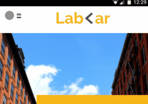
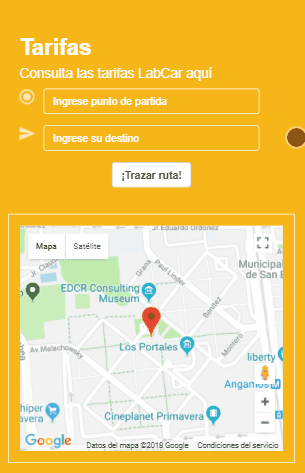
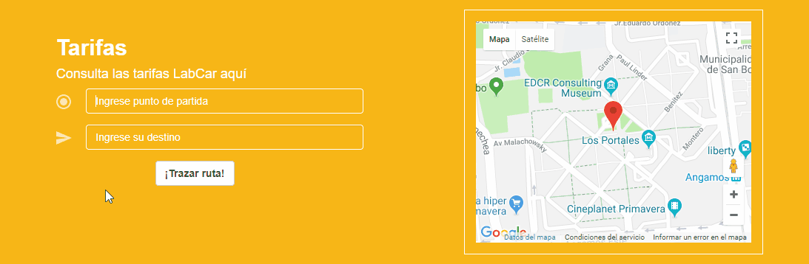

# labCar

## ¿Qué es?

Es una empresa de taxis que te permite pedir un taxi cuando quieras y en donde quieras.    
Tenemos las tarifas más bajas del mercado.    
Sabemos que tu tiempo es dinero, por lo que si nuestro servicio se demora en llegar más de lo establecido te daremos un 10% de descuento en tu viaje.

## Requerimientos

- Responsive design (mobile, desktop)
- Framework de bootstrap
- Google maps API

## Componentes de la página

### Navegador
 > #### Móvil
 > 
 
 > ### Escritorio
 > 
 
### Tarifa
 + Calcula la tarifa de acuerdo a la distancia entre los lugares que elijas
 > #### Móvil
 > 
 
 > ### Escritorio
 > 
 
 ## Librerias externas

+ [Jquery](https://jquery.com/)

## Frameworks CSS

+ [Bootstrap](https://getbootstrap.com/)